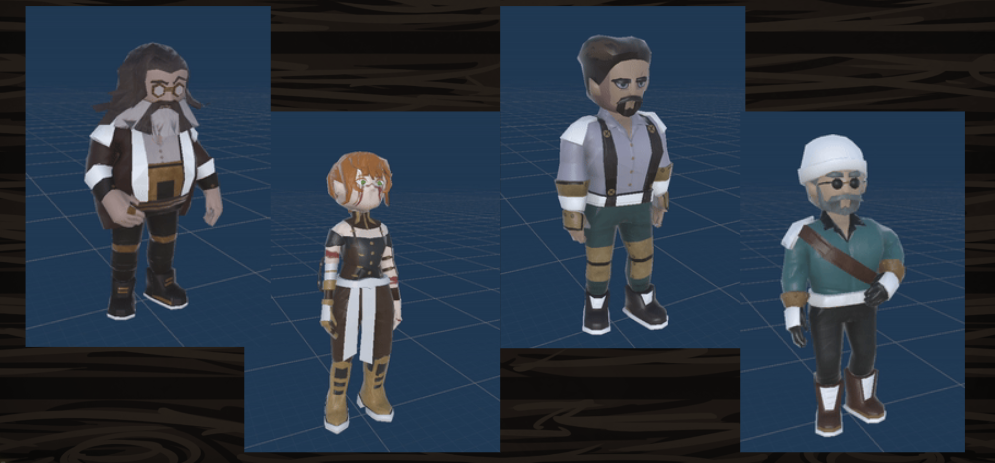

# SteamTrain  
  
  

# Introduction 

Steam Train is a collaborative **tower-defense / roguelike** set in a steampunk universe, where players must work together to defend a modifiable armored train and its cargo against bandit attacks using humorous and absurd traps.  
  
  
# The Team  
  

## Dev

  
**Vincent M.** : Product Owner / Game Designer & Game Developer / Integration / Music Composer.  
**Alexandre R.** : Game Designer / Game Developper / Integration / SFX.  
  

## Artists :

**Marine A.** : 3D, 2D, concept arts
**Mathis G.** : 3D, concept arts, SFX

# Game's presentation

## The Characters

2 to 4 players

## Enemies

## Wagons

